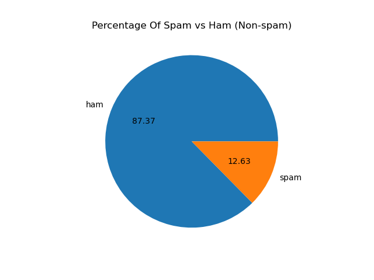
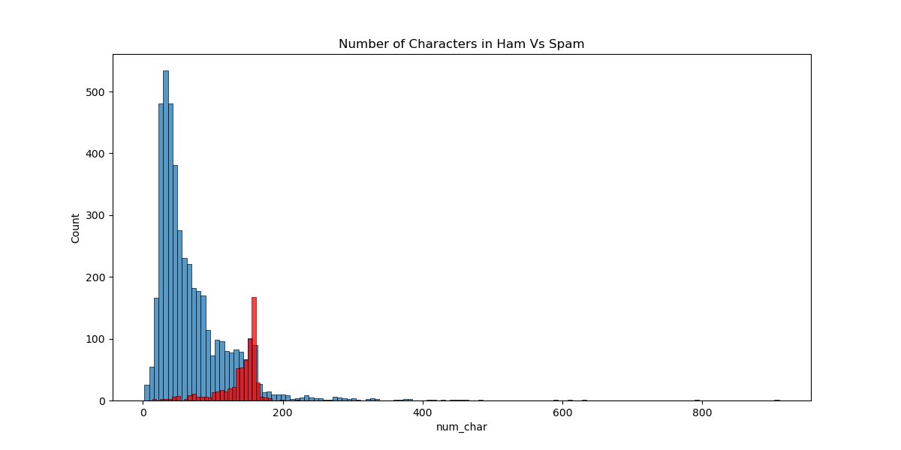
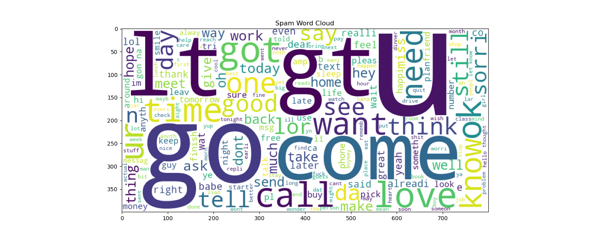
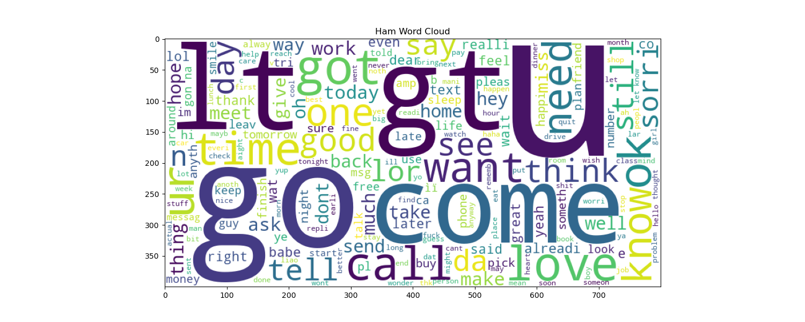
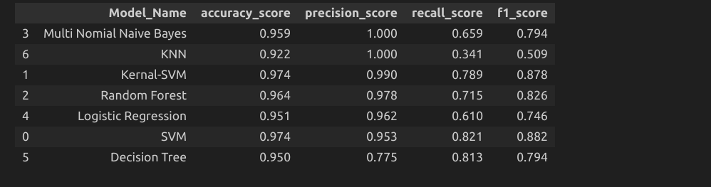

<h1 align="center"> Email/SMS Spam Classifier</h1>

 

## [App Link](http://3.90.173.204:8080/home)
 

<h2> :floppy_disk: Table of Content</h2>

 
  * [Introduction](#Introduction)
  * [Problem Statement](#Problem-Statement)
  * [Objectives](#Objectives)
  * [Data Summary](#Data-Summary)
  * [Steps Involved](#Steps-Involved)
  * [EDA](#EDA)
  * [Algorithms used](#Algorithms-used)
  * [Conclusion](#Conclusion)

<h2> 📄 Introduction</h2>

The SMS/Email Spam Classifier project utilizes machine learning to automatically identify and filter out spam messages from legitimate ones. By analyzing message content and characteristics, the classifier distinguishes between spam and non-spam messages with high accuracy. Through training on labeled datasets and evaluation on test datasets, the project aims to develop a robust spam detection system. Integration of this classifier into messaging platforms enhances security and usability by reducing the impact of unwanted spam messages.

<h2> ❓ Problem Statement</h2>

The SMS/Email Spam Classifier project addresses the challenge of efficiently filtering out unwanted spam messages from legitimate ones. With the exponential growth of digital communication, users face an increasing volume of spam, leading to inconvenience, privacy concerns, and potential security risks. By developing a reliable spam detection system using machine learning techniques, this project aims to provide users with a seamless and secure messaging experience, free from the nuisance of unsolicited spam content.

<h2> 🎯 Objectives: </h2>

1. Develop a robust machine learning model to accurately classify SMS and email messages as either spam or legitimate.
2. Explore and analyze various feature extraction techniques to capture the distinguishing characteristics of spam messages.
3. Implement hyperparameter tuning and cross-validation to optimize the model's performance and generalization capabilities.
4. Provide an intuitive user interface for users to interact with the spam classifier, ensuring ease of use and accessibility.
5. Evaluate the effectiveness of the classifier using performance metrics such as precision, recall, and F1-score, aiming for high accuracy and reliability in spam detection.

<h2> :book: Data Summary </h2>

The data contained 5,574 messages including spam and non-spam

The dataset contains the following information:

* **Messages**

* **Class** - Spam/Ham

<h2> 📑 Steps involved </h2>

1. Exploring the data: Analyzing the features and target variable, checking for null values and duplicates, plotting the distribution of target variable, etc.

2. Text Preprocessing using stemming,stop words removal,tokenization,lower casing..etc

3. Future extraction using Count vectorizer and TFIDF

3. Train test split

4. Develop different models and evaluate them.

<h2>🛠️ EDA </h2>

In this project, the dependent variable is ‘Spam or Ham’, the prediction of which gives us message is spam or not

We can observe that the dataset is unbalanced.

<h2>Getting Started</h2>

1.[RawData](https://github.com/Muhliscm/spam_classifer/blob/main/spam.csv)  
2.[Exploratory Data Analysis scripts](https://github.com/Muhliscm/spam_classifer/blob/main/01_EDA.ipynb) 
3.[Machine learning model building scripts](https://github.com/Muhliscm/spam_classifer/blob/main/01_Model_building.ipynb) 

<h2>💻 Algorithms used</h2>

* Logistic Regression

* Kernal-SVM

* SVM
  
* Random Forest
  
* KNN

* Decision Tree

* Naive Bayes	

<h3> Model Comparison </h3>

All the models are evaluated on the basis of the following evaluation metrics.

Selected Naive Bayes based on precision score

<h3> Best Hyper-parameters </h3>

* Naive Bayes:

- 'nb__alpha': 1.0
- 'tfidf__max_features': 3000
- 'tfidf__ngram_range': (1, 2)
  

<h2>:bulb: Conclusion</h2>

This project focuses on finding spam messages

* In eda we found that spam message have high median character count

* Among all these models Naive Bayes gives us a precision of of 100%

 

<!-- CREDITS -->
<h2 id="credits"> :scroll: Credits</h2>

MUHLIS CM | Data Scientist | Machine Learning Engineer 

 <i> Contact me for Data Science Project Collaborations</i>

